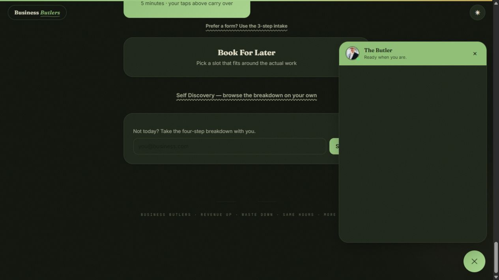
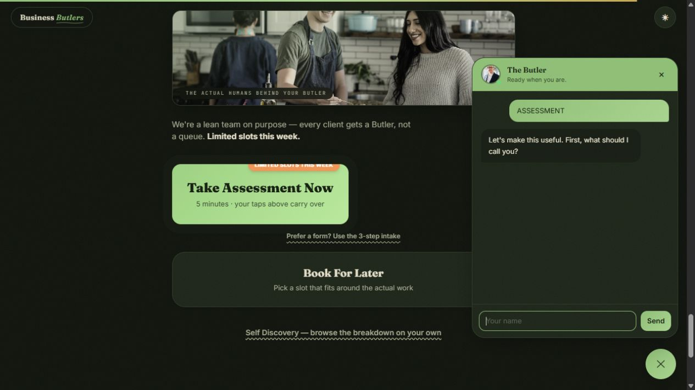
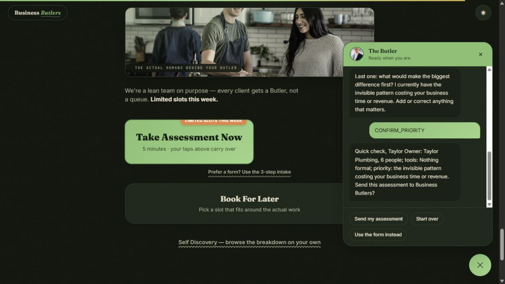
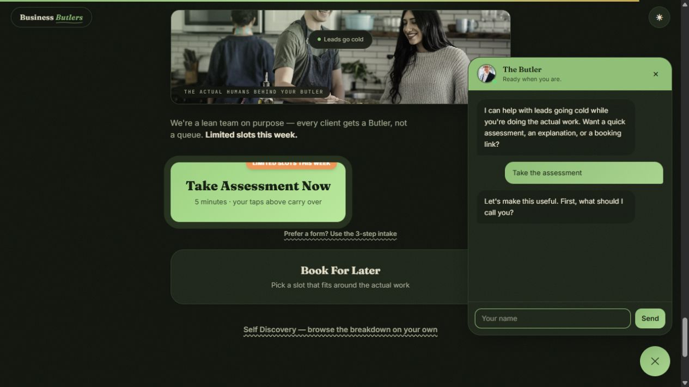

# QA Report: Business Butlers integration

| Field | Value |
|---|---|
| Date | 2026-08-11 |
| App URL | `http://127.0.0.1:5174` |
| Scope | Landing page, auto-triggered chat, adaptive assessment, intake form, supporting pages, mobile viewport |
| Framework | React 19 + Vite 8; DASCB WebSocket/REST backend |

## Summary

| Severity | Found | Fixed | Deferred |
|---|---:|---:|---:|
| Critical | 0 | 0 | 0 |
| High | 1 | 1 | 0 |
| Medium | 1 | 1 | 0 |
| Low | 1 | 1 | 0 |
| **Total** | **3** | **3** | **0** |

Baseline health score: **96/100**. Final tested-surface health score: **100/100**.

## Issues

### ISSUE-001: Local widget connected to the wrong loopback hostname

| Field | Value |
|---|---|
| Severity | high |
| Category | functional |
| URL | `http://127.0.0.1:5174/` |
| Fix status | verified |

The assistant showed “Ready when you are” but rendered no greeting, and the assessment CTA remained in a responding state. The development fallback was hard-coded to `localhost:3001` while the page ran on `127.0.0.1`; deriving the API hostname from the page fixes local and proxied development environments.

### ISSUE-002: Internal routing tokens appeared in the transcript

| Field | Value |
|---|---|
| Severity | medium |
| Category | UX |
| URL | `http://127.0.0.1:5174/` |
| Fix status | verified with backend regression test |

Option selections were stored as values such as `ASSESSMENT`, `CONFIRM_PRIORITY`, and `SUBMIT`. Protocol v1 now accepts an optional visitor-facing `displayText` while continuing to route on stable values. Duplicate delivery-result notices were also removed because the server already sends the corresponding bot message.

### ISSUE-003: Privacy storage disclosure described cookies the site does not use

| Field | Value |
|---|---|
| Severity | low |
| Category | content |
| URL | `http://127.0.0.1:5174/privacy.html` |
| Fix status | verified |

The policy still described form-state and consent cookies. It now names the actual local/session storage: theme, assessment state/transcript, random session identifier, and one-time trigger state.

## Verified behavior

- Assistant stays hidden before qualification, opens at the qualification section, and does not auto-open again after reload in the same browser session.
- Landing-page answers personalize the assistant and survive reconnect/refresh through the session snapshot.
- The adaptive assessment validates email, collects required name/email and three optional context prompts, provides review/restart, and preserves answers when delivery fails.
- Missing n8n configuration never produces false success. Chat and intake form expose retryable failure states.
- Alternate intake restores name/email from the chat snapshot and submits through the same REST lead endpoint.
- Desktop and 375×812 viewport checks show the assistant remains usable with no captured console errors.
- `/demo-report.html`, `/privacy.html`, `/terms.html`, and `/cookies.html` load with the expected titles/headings and no captured console errors.

## Environment-limited checks

The live n8n Data Tables, SMTP confirmation, Calendly account, and Vercel production projects require the deployment credentials and real environment values. Their code/configuration and failure behavior were verified locally; successful third-party delivery remains a deployment smoke test.

PR summary: QA found 3 issues and fixed all 3; tested-surface health score improved from 96 to 100.
